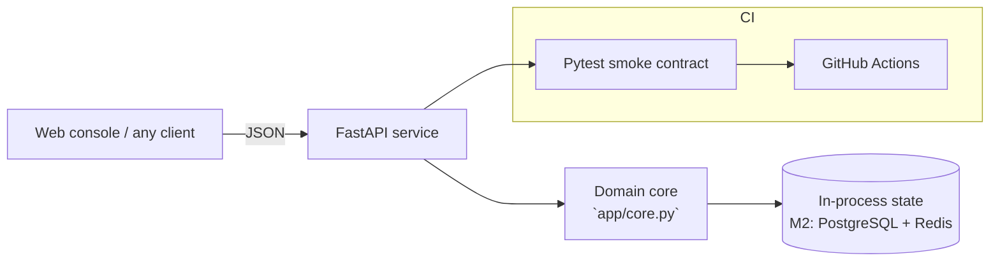

# VERITY — LLM Evaluation Observatory

**Domain:** LLM Evaluation · AI Observability · Safety

## Problem

Prompt and model changes ship on vibes; regressions in grounding, refusal rate or data leakage surface only via user complaints.

## Solution

A regression observatory for LLM systems: per-case scoring of grounding, leakage, refusal and verbosity, aggregated into run-level reports with worst-case surfacing — CI-friendly so prompt changes get gated like code.

## Why this project for the **AI Engineer** role at **Ecolab**

This system was scoped to demonstrate, end to end, the skills the job description emphasises: **LLMs**. Milestone M1 is fully implemented and tested in this repo; M2–M4 are the documented growth path.

## Architecture



The core is intentionally dependency-free (FastAPI + stdlib) so it runs
anywhere in seconds; every integration point for production hardening is
marked in the milestone plan.

## API surface

| Method | Path |
|---|---|
| `GET` | `/health` |
| `POST` | `/api/score` |
| `GET` | `/api/report/r1` |

Interactive docs: `http://localhost:8000/docs`

## Quickstart

```bash
cd backend
pip install -r requirements.txt
uvicorn app.main:app --reload          # http://localhost:8000
python -m pytest -q                    # smoke contract
```

Or with Docker:

```bash
docker compose up --build
```

## Impact

- Turns 'does the new prompt still work?' into a numeric report with worst-case drill-down
- Leakage metric catches forbidden-content regressions before users do

## Roadmap

- M1 (shipped): scoring core, run reports, worst-case surfacing, CI
- M2: LLM-as-judge graders with calibration against human labels
- M3: GitHub Action that fails PRs on metric regression vs baseline run
- M4: trace ingestion (OpenTelemetry) + cost/latency dashboards

## Tech & concepts

LLM Evaluation, LLMs, Prompt Engineering, Monitoring & Observability, Fine-tuning, OpenAI API, Anthropic Claude, Statistics, pytest
